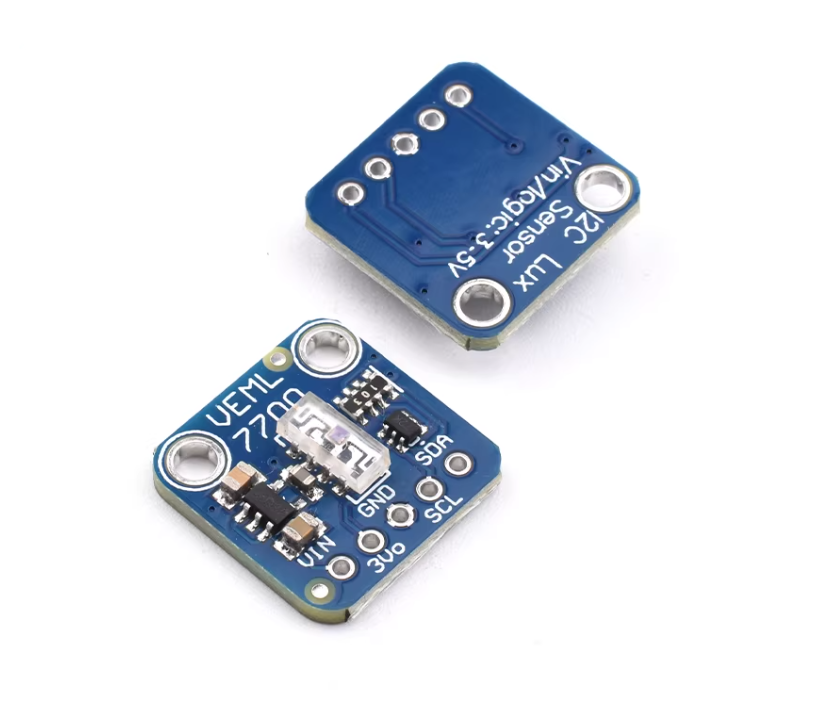

# VEML7700 传感器测试工程 (ESP32-S3)



这是一个基于 `esp-hal` 和 `veml7700` 驱动的 Rust 嵌入式工程，用于在 ESP32-S3 上通过 I2C 读取 VEML7700 环境光传感器的光照度 (Lux) 数据。

## 硬件接线

本工程默认使用以下引脚进行 I2C 通信：

| VEML7700 | ESP32-S3 | 备注 |
| :---: | :---: | :--- |
| **VCC** | **3.3V** | 传感器电源供电 |
| **GND** | **GND** | 共地 |
| **SDA** | **GPIO1** | I2C 数据线 |
| **SCL** | **GPIO0** | I2C 时钟线 |

> **注意：** 如果您的实际接线不同，请在 `src/main.rs` 中修改 `.with_sda()` 和 `.with_scl()` 的引脚配置。

## 快速运行

确保您已经配置好了 `esp-rs` 开发环境，并且开发板已经连接到电脑。

在工作区根目录 (`esp-rs-lab`) 运行以下命令编译并烧录运行：

```bash
cargo run --bin veml7700
```

运行后，您应该能在串口输出中看到如下类似的环境光照度信息：

```text
INFO - Initializing I2C...
INFO - Initializing VEML7700...
INFO - Illuminance: 123.45 lux
INFO - Illuminance: 124.00 lux
...
```

## 📝 行动项 (TODO)

- [ ] **整机光学标定**：VEML7700 芯片出厂本身经过校准，但装入产品外壳（或在有保护玻璃的情况下）会产生极大的透光衰减。需使用标准照度计进行实测比对，并在代码层面除以 `OPTICAL_WINDOW_LOSS` 透光率系数（例如 0.83）来进行结构化的光强衰减补偿。
- [ ] **高亮非线性处理**：若直接在强阳光下运行，需要检查传感器 Raw 值是否饱和以及考虑是否需要动态调整 `IntegrationTime` 和 `Gain`。

## 依赖说明

- [esp-hal](https://github.com/esp-rs/esp-hal): ESP 官方 Rust 硬件抽象层。
- [veml7700](https://crates.io/crates/veml7700): 社区提供的 VEML7700 传感器驱动。
